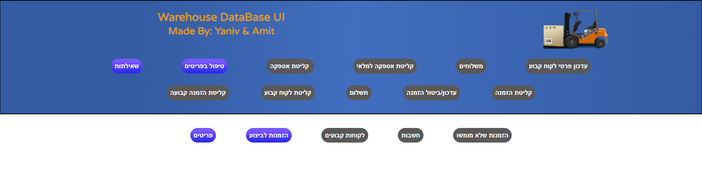
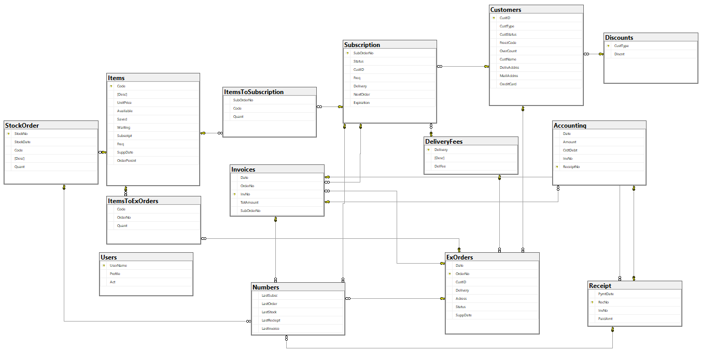
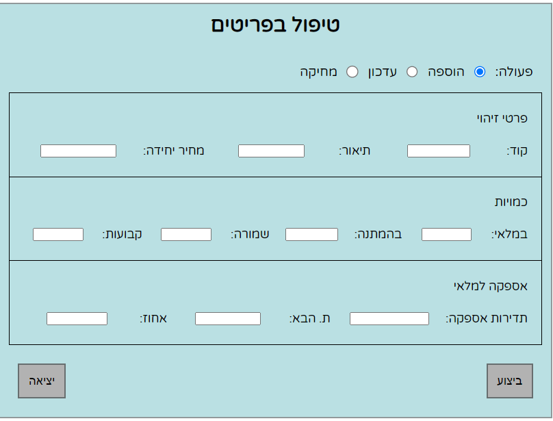
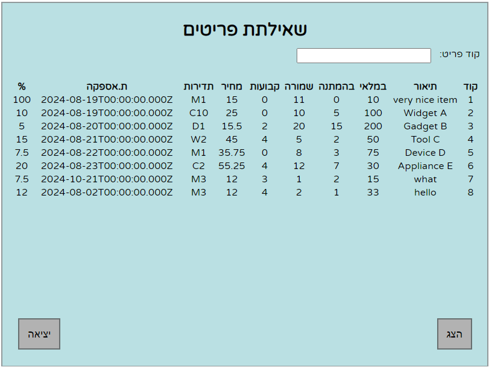
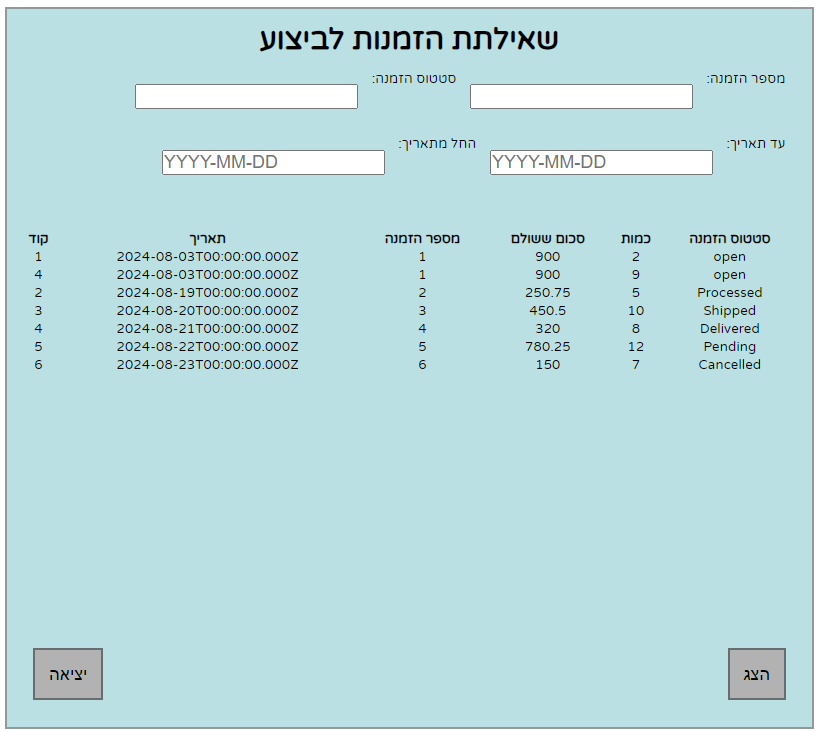

# Simple fullstack project for website

We built mssql database "Warehouse" from scratch according to the [requirements file](./assets/דף%20איפיון.pdf) &
used Node.js to connect our mssql database to a vanilla js/css frontend.  
This project focuses on connectivity and adheres to the MVC approach.

## Project Overview
- **Model**: Our own MSSQL database ["Warehouse"](./assets/WarehouseDB.bak).  
[SQL Queries](./assets/WareHouseQueries.sql)
### WareHouse ERD:

- **View**: A visual representation of the model using html, vanilla js and vanilla css.  
            Connects to the server using the fetch api.

- **Controller**: A Node.js server using express.

## Contributors
- [Yaniv Ridel](https://github.com/Yanivridel)
- [Amit Kubani](https://github.com/AgitAgit)

## Gallery

### Item Handling Form
- Item add / update / delete fuctionality  

### Queries
- Items Query  

- ExOrders Query  

